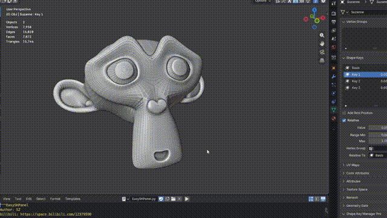

# EasySKPanel

EasySKPanel is a Blender Python script that creates bone sliders for controlling mesh shape keys.

The script supports selecting multiple mesh objects at once. Shape keys are grouped by mesh in the selection dialog, and selected shape keys with the same name can share one bone slider across multiple objects.

## What's new

- Generate one controller panel for multiple selected mesh objects.
- Choose same-named shape keys independently for each mesh.
- Use one shared bone slider to control the selected same-named shape keys.
- Preserve shape-key values and animation when creating controllers.
- Transfer existing shape-key keyframes to the slider bones without baking every frame.
- Restore slider values and keyframes to the affected shape keys when removing the controller.
- Preserve existing drivers that were not created by EasySKPanel.

## Compatibility

Tested and confirmed working with Blender 3.6 and Blender 5.2.

## Requirements

- Blender with Python scripting support
- One or more mesh objects containing shape keys

## Usage

1. Download `EasySKPanel.py`.
2. Open Blender and switch to the **Scripting** workspace.
3. Open `EasySKPanel.py` in the Text Editor.
4. In Object Mode, select one or more mesh objects containing shape keys. Keep the desired primary mesh active.
5. Click **Run Script**.
6. Choose the shape keys you want to control under each mesh name and confirm.

Selected shape keys with the same name share one slider. Run the script again with a source mesh or its generated EmjPanel selected to update or remove the controls. Removing the panel transfers the controller animation back to the affected shape keys.

## Notes

- Existing drivers not created by EasySKPanel are preserved.
- Same-named shape keys can share a slider only when their selected values and keyframe animation are compatible.
- Save a backup of important `.blend` files before using scripts that modify a scene.
- The generated panel uses the `EmjPanel` name internally for compatibility with the script.

## Author

SZ

- [GitHub](https://github.com/sezhiyanhua)
- [Bilibili](https://space.bilibili.com/12379590)

## License

Released under the [MIT License](LICENSE).
